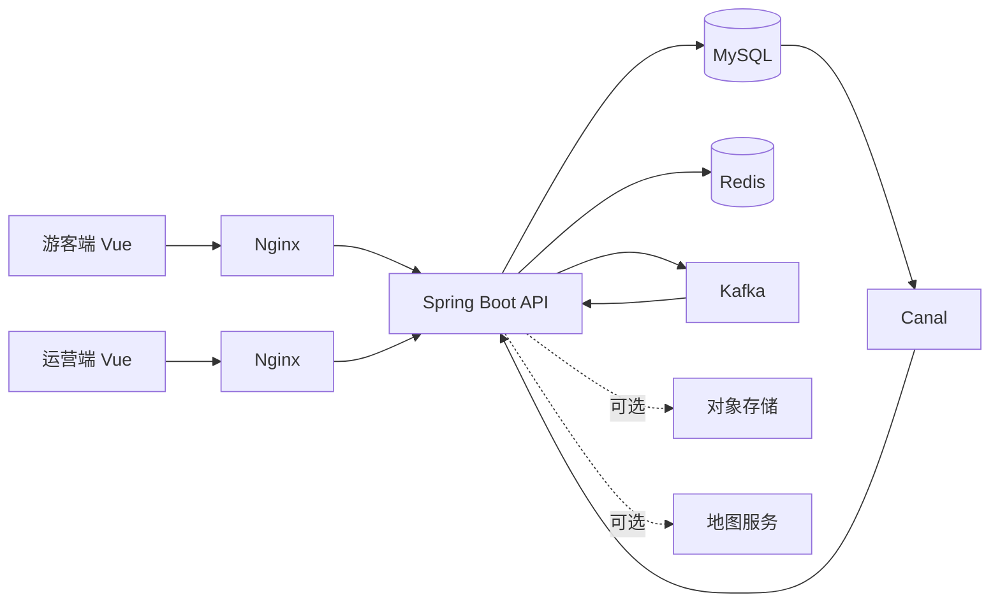

# 文旅票务运营平台

一个面向多景点运营场景的预约、购票与入场管理平台。系统为游客提供景点浏览、场次预约、优惠券领取、订单和电子票管理，为景点运营方提供场次、票种、工作人员、核销和经营数据管理。不同运营账号的数据按所属景点隔离。

项目包含可独立运行的游客端、运营端和 Spring Boot 服务，并提供完整的容器化运行环境与动态演示数据。

## 功能概览

### 游客端

- 游客注册、登录与 JWT 身份认证
- 景点列表、详情、附近景点和场次票种查询
- 常用参观人管理与同场次一人一单校验
- 预约下单、模拟支付、取消订单和整单退款
- 优惠券活动查询、异步抢券和个人优惠券管理
- 订单与电子票查询
- 景点评论及评论点赞

### 运营端

- 当前景点资料维护与封面上传
- 工作人员账号管理
- 票种、场次和场次库存配置
- 事件驱动的场次状态流转
- 订单查询与详情查看
- 电子票核销与核销记录查询
- 优惠券活动创建、发布和库存管理
- 收入、售票量、核销量及票种排行统计

## 关键设计

- 订单库存使用数据库条件更新和事务控制，避免并发超卖；同场次参观人约束使用分布式锁串联校验与下单事务。
- 优惠券抢券通过 Redis Lua 完成资格校验、库存预扣和一人一券，Kafka 异步落库，并配有 Redis Outbox、消费幂等、重试和死信补偿。
- 景点与场次静态信息采用 Caffeine、Redis 两级缓存；缓存重建使用 Redisson 锁缓解击穿，Canal 订阅 MySQL Binlog 并通过 Redis Pub/Sub 通知多实例失效本地缓存。
- 景点附近查询使用 Redis GEO；不存在的景点 ID 通过布隆过滤器提前拦截。
- 订单与场次使用显式状态事件管理流转；退款采用 `PAID -> REFUNDING -> REFUNDED` 分阶段确认，并由定时任务对账未完成退款。
- 数据库结构由 Flyway 管理，HTTP 接口通过 OpenAPI 描述。

## 系统结构



## 技术栈

- 后端：Java、Spring Boot、MyBatis、Flyway、MySQL
- 缓存与并发：Redis、Caffeine、Redisson、Lua
- 消息与一致性：Kafka、Canal、Redis Pub/Sub
- 前端：Vue 3、TypeScript、Vite、Pinia、Element Plus
- 工程化：Maven、Docker Compose、OpenAPI、JUnit、JMeter

## 快速开始

### Docker 一键启动

准备 Docker 与 Docker Compose，在仓库根目录执行：

```bash
docker compose up --build -d
```

Windows 也可以双击 `scripts/start-demo.cmd`；Linux 或 macOS 可以执行：

```bash
sh scripts/start-demo.sh
```

启动过程会自动完成以下工作：

1. 启动 MySQL、Redis、Kafka 和 Canal。
2. 构建并启动 Spring Boot 后端。
3. 通过 Flyway 创建数据库结构并导入演示数据。
4. 构建游客端和运营端，并由 Nginx 提供页面及 API 代理。

服务入口：

| 服务 | 地址 |
| --- | --- |
| 游客端 | <http://localhost:3000> |
| 运营端 | <http://localhost:3001> |
| Swagger UI | <http://localhost:8080/swagger-ui/index.html> |
| OpenAPI JSON | <http://localhost:8080/v3/api-docs> |

演示账号的密码均为 `123456`：

| 角色 | 登录名 | 可用范围 |
| --- | --- | --- |
| 游客 | `tourist_demo` | 浏览、预约、订单、票券、优惠券与评论 |
| 运营者 | `operator_lingnan` | 岭南文化博物馆运营管理 |
| 运营者 | `operator_yunshan` | 云山生态公园运营管理 |
| 工作人员 | `staff_lingnan` | 岭南文化博物馆票券核销 |

演示场次和优惠券时间均以首次建库日期动态生成，因此不会因固定日期过期。演示环境首次启动后，优惠券预热任务会自动将可领取活动写入 Redis。

### 停止与重置

停止服务并保留数据：

```bash
docker compose down
```

如需重新生成全套演示数据，可删除 Compose 数据卷后重新启动。该操作会永久删除当前容器数据库和缓存数据：

```bash
docker compose down -v
docker compose up --build -d
```

### 配置覆盖

默认配置用于本地演示，无需预先创建 `.env`。如需修改端口、数据库密码或接入地图与 OSS，可复制示例文件：

```bash
cp .env.example .env
```

地点名称搜索依赖高德 Web 服务 Key，景点封面上传依赖阿里云 OSS。未配置这两项时，坐标附近查询、景点浏览、预约购票等核心功能仍可正常使用。

## 本地开发

后端要求 Java 17。确保 MySQL、Redis 和 Kafka 已启动并设置 `DB_PASSWORD`、`JWT_SECRET` 等环境变量后，在仓库根目录执行：

```bash
./mvnw -pl tourism-server -am spring-boot:run
```

Windows 使用：

```powershell
.\mvnw.cmd -pl tourism-server -am spring-boot:run
```

两个前端应用独立运行：

```bash
cd frontend/tourist
npm install
npm run dev
```

```bash
cd frontend/operator
npm install
npm run dev
```

Vite 开发服务器会将 `/api` 请求代理到 `http://localhost:8080`。

## 项目结构

```text
tourism-ticketing-platform/
├── tourism-common/       # 公共响应、异常、常量与工具
├── tourism-pojo/         # Entity、DTO、VO 与业务枚举
├── tourism-server/       # Spring Boot 服务与 Flyway 迁移
├── frontend/
│   ├── tourist/          # 游客端 Vue 应用
│   └── operator/         # 运营端 Vue 应用
├── docker/               # 后端、前端镜像及 Nginx 配置
├── docs/                 # 数据库、接口和测试文档
├── tests/                # JMeter 场景与测试资源
└── compose.yaml          # 完整本地运行环境
```

## 接口与数据文档

- [OpenAPI 接口定义](docs/openapi.json)
- [接口说明](docs/接口文档/接口说明)
- [数据库设计](docs/database-design/表设计总览.md)

## 构建与检查

```bash
# 后端测试
./mvnw test

# 后端打包
./mvnw -pl tourism-server -am package -DskipTests

# 前端类型检查与构建
cd frontend/tourist && npm run type-check && npm run build
cd frontend/operator && npm run type-check && npm run build
```

项目运行产生的密码、令牌、云服务密钥与本地 `.env` 文件不应提交到仓库。正式部署时应替换 Compose 中的演示凭据，并按部署环境调整数据库、Redis、Kafka 与 Canal 配置。
